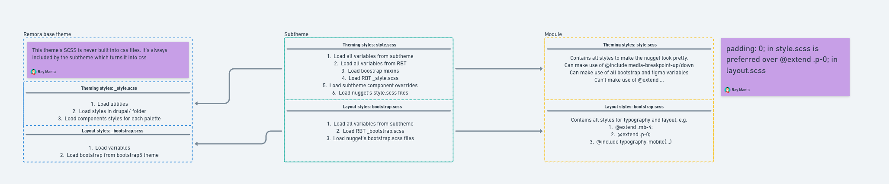

# Custom installation profile

It will install all the default CTs and generate an appropriate subtheme.

## Functionalities

- Installs defined themes and modules during Drupal installation which are defined in info file.
- Provides additional steps for setting up the subtheme.
- Generates barrio_base_theme-based subtheme using Bootstrap 5.
- Generates boilerplate SCSS files containing all the relevant variables.

## Module styling
The subtheme has a SCSS file per module's SCSS file. By default, we have a `style.scss` and `bootstrap.scss` file. The `bootstrap.scss` file is used for layout styling and typography (mainly involving bootstrap `@extends`), while the style.scss file is used for general styling.  
Modules SCSS files are imported into the subtheme's SCSS file with the matching name. If the file doesn't exist yet in the subtheme, it will be created however not imported into a new SCSS file.

This SCSS generation is only ran on initial installation of the module, and therefore if the module doesn't initially have a `scss/*.scss` file, it will not be added to the subtheme's SCSS file.
Instead, the module can implement a hook like below.

```php
function hook_update_N(): void
{
  Drupal::service('installation_profile.manager.module_scss')->linkStyles('module_name');
}
```

This can safely be run on every environment, since the linkStyles method will only add the import statement if `_modules.scss` doesn't already have an import for the module.  

The import statement is automatically removed when the module is uninstalled. 

The import flow can be found in [whimsical](https://whimsical.com/rbt-subtheme-styling-VobDDkYidw4ugSF6kda4Ev@or4CdLRbgitaZD25VZX8qyTGHRARyEgiEBbV7aq8j), a screenshot has been included below.



## Subtheme generation

During the generation of the subtheme all the required files for the subtheme to build and be installable are created.

A lot of files, such as `theme_name.breakpoints.yml` will be [inherited](https://www.drupal.org/docs/theming-drupal/sub-theme-inheritance) from the base theme and will be omitted for this reason. They
can be generated as
and when needed.

### Figma config
The JSON importer's behaviour is mainly controlled by a YAML file located at in the [config](config/figma_config.yml). This file contains a few options:
- config.dedupe: {boolean, default: true} Whether at the start of variables, duplicate names should be removed. e.g. card-card-background => card-background.
- config.singularize: {boolean, default: true} Whether keywords should be singularized. e.g. cards => card. Every group in a JSON file is a keyword, so given the example structure below, "components", "cards", and "card-background" are all keywords.
- overrides {object}: An object where extra variables/variable overrides can be added. Formatted as {"pallete": {"group": {"variable": {"$type": "...", "$value": "..."}}}}
- mapping {object}: Allows you to manually map keywords, bypassing the singularizing of the keyword. This is mainly used to strip keywords from variable names such as "components", since this would just add clutter to the variable name.

Each palette will get its own SCSS file.  
The importer will automatically sort groups of variables based on their occurrence, so variables that are never cross-referenced will be added towards the bottom of its palette file, where are variable groups that are mentioned a lot (think global-color) will appear towards the top of the file.
Keywords are contained between groups. in the example below, given no mapping is in place, the final name for the accordion variables will be `$components-accordion-accordion-background`.
Figma variables can reference other variables, and if Figma can do it, so can we. In the example below, assuming de-dupe is enabled the resulting card's variable will look like this in SCSS `$card-background: $primary-color-primary;`.  

Every generated theme must have a figma theme called components, the variables within this file are used for the default palette styles.

#### Config override
To override the default figma_config file, simple copy it over to `private://figma_config.yml`, make your adjustments and run the drupal installation profile as you would normally.

#### Example
```json
{
  "card": {
    "card-background": {
      "$type": "color",
      "$value": "{primary-color.primary}"
    }
  },
  "components": {
    "accordion": {
      "accordion-background": {
        "$type": "color",
        "$value": "#cc33cc"
      },
      "padding-y": {
        "$type": "number",
        "$value": 8
      }
    }
  }
}
```
