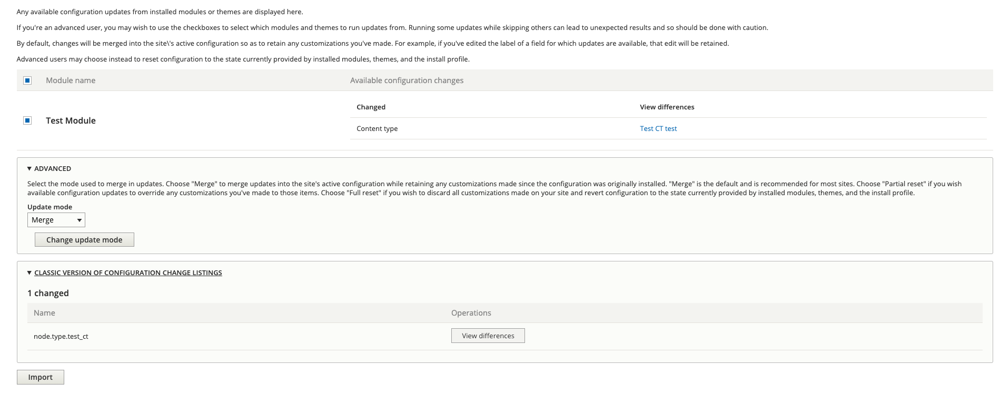

# Example of extendable configuration

test_module/test_module.info.yml

```yaml
name: Test Module
type: module
description: some desc
package: 'MRM'
core_version_requirement: ^9
```

test_module/test_module.info.yml

```yaml
name: Test Module
type: module
description: some desc
package: 'MRM'
core_version_requirement: ^9
```

test/module/config/install/node.type.test_ct.yml

```yaml
uuid: null
langcode: en
status: true
dependencies:
module:
  - menu_force
  - menu_ui
third_party_settings:
menu_ui:
available_menus:
  - main
parent: 'main:'
menu_force: 0
menu_force_parent: 0
name: 'Test CT'
type: test_ct
description: ''
help: ''
new_revision: true
preview_mode: 1
display_submitted: true
```

After you install test module, you should have Test CT available. 

Make sure you installed and enabled Configuration synchronization module.

Change Test CT configuration file e.g.

```yaml
uuid: null
langcode: en
status: true
dependencies:
module:
  - menu_force
  - menu_ui
third_party_settings:
menu_ui:
available_menus:
  - main
parent: 'main:'
menu_force: 0
menu_force_parent: 0
name: 'Test CT test new test'
type: test_ct
description: ''
help: ''
new_revision: true
preview_mode: 1
display_submitted: true
```

If you did everything right, Configuration synchronization should show you something similar as image.



Changes can be applpied through Drupal UI or by running drush command 'drush config-distro-update'.
